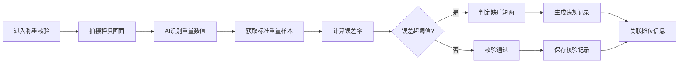

## 1. 产品概述

本系统是面向大型便民生鲜菜市场的智能巡检应用，通过图像识别和机器学习技术，解决市场管理人员人工巡检效率低、无法及时发现违规问题的痛点。系统可自动识别蔬果品类、检测腐烂变质货品、辅助核验称重是否缺斤短两，并提供违规台账、预警分析和月度报表功能，帮助市场优化摊位管理规则。

- **核心问题**：人工巡检效率低，难以及时发现腐烂变质果蔬上架、摊贩缺斤短两等违规问题
- **目标用户**：市场巡检人员、市场管理人员、运营分析人员
- **产品价值**：提升巡检效率80%以上，违规问题发现及时率提升至95%，实现数字化、智能化市场管理

## 2. 核心功能

### 2.1 用户角色

| 角色 | 登录方式 | 核心权限 |
|------|----------|----------|
| 巡检人员 | 账号密码登录 | 现场拍照巡检、识别结果确认、违规记录提交 |
| 市场管理员 | 账号密码登录 | 违规台账管理、预警查看、摊位管理、数据统计 |
| 运营分析员 | 账号密码登录 | 月度报表查看、损耗分析、违规趋势分析 |

### 2.2 功能模块

1. **巡检拍照页面**：现场拍照、AI实时识别、结果确认、违规标记
2. **称重核验页面**：称重图像采集、AI重量识别、标准对比、缺斤短两判定
3. **违规台账页面**：每日违规记录、摊位信息、违规类型、处理状态
4. **预警中心页面**：高频违规商户预警、变质高发品类预警、实时通知
5. **数据报表页面**：月度汇总报表、损耗分析、违规趋势图、摊位排名

### 2.3 页面详情

| 页面名称 | 模块名称 | 功能描述 |
|---------|---------|----------|
| 巡检拍照页 | 相机模块 | 调用设备摄像头、支持连拍、图片预览 |
| 巡检拍照页 | AI识别模块 | 实时识别蔬果品类、判断新鲜/腐烂状态、置信度显示 |
| 巡检拍照页 | 违规标记 | 选择摊位、填写备注、提交违规记录 |
| 称重核验页 | 图像采集 | 拍摄秤具显示画面、自动裁剪识别区域 |
| 称重核验页 | 重量识别 | OCR识别数字、与标准重量对比、计算误差率 |
| 称重核验页 | 结果判定 | 自动判断是否缺斤短两、生成核验记录 |
| 违规台账页 | 记录列表 | 按日期筛选、违规类型筛选、摊位搜索 |
| 违规台账页 | 详情查看 | 查看违规照片、识别结果、处理记录 |
| 违规台账页 | 处理操作 | 标记处理状态、添加处理备注 |
| 预警中心页 | 商户预警 | 高频违规商户列表、违规次数统计、预警等级 |
| 预警中心页 | 品类预警 | 变质高发品类、损耗率统计、趋势分析 |
| 预警中心页 | 实时通知 | 新违规预警推送、预警确认处理 |
| 数据报表页 | 月度汇总 | 全市场巡检数据、违规类型分布、处理率统计 |
| 数据报表页 | 损耗分析 | 变质损耗高发品类、损耗趋势、摊位损耗对比 |
| 数据报表页 | 违规分析 | 高频违规商户排名、违规类型趋势、摊位合规率 |

## 3. 核心流程

### 3.1 巡检识别流程

巡检人员登录系统后，进入巡检拍照页面，选择当前摊位，拍摄蔬果图片。AI模型实时识别品类和新鲜度，若检测到腐烂变质则自动标记为违规，巡检人员确认后提交记录，系统更新违规台账并触发预警。

### 3.2 称重核验流程

巡检人员进入称重核验页面，拍摄摊贩秤具显示画面，系统自动识别重量数值并与标准重量样本对比。若误差超出阈值则判定为缺斤短两，生成核验记录并关联摊位信息。

## 4. 用户界面设计

### 4.1 设计风格

- **主色调**：深绿色 (#15803D) - 代表生鲜、健康、可信赖
- **辅助色**：橙色 (#F97316) - 用于预警、强调；红色 (#DC2626) - 用于违规标记
- **中性色**：深灰 (#1F2937) 用于文字，浅灰 (#F3F4F6) 用于背景
- **按钮风格**：圆角8px，微渐变填充，悬停有轻微上浮效果
- **字体**：标题使用 Noto Sans SC Bold，正文使用 Noto Sans SC Regular
- **布局风格**：卡片式布局，顶部导航栏，侧边菜单，内容区网格化排列
- **图标风格**：线性图标，统一24px尺寸，颜色与主题一致

### 4.2 页面设计概览

| 页面名称 | 模块名称 | UI 元素 |
|---------|---------|---------|
| 巡检拍照页 | 相机区域 | 全屏取景框、实时识别框、拍照按钮、闪光灯开关 |
| 巡检拍照页 | 识别结果 | 浮动卡片、品类标签、新鲜度进度条、置信度百分比 |
| 巡检拍照页 | 操作区域 | 摊位选择下拉、备注输入框、提交按钮、重拍按钮 |
| 违规台账页 | 筛选区域 | 日期范围选择器、违规类型标签、搜索框、导出按钮 |
| 违规台账页 | 列表区域 | 卡片式列表、摊位名称标签、违规类型徽章、缩略图预览、状态标签 |
| 预警中心页 | 预警概览 | 统计卡片、预警等级分布环形图、趋势折线图 |
| 预警中心页 | 预警列表 | 优先级排序、商户卡片、违规次数进度条、预警指示灯 |
| 数据报表页 | 数据可视化 | 柱状图对比、饼图分布、折线趋势、热力图展示 |
| 数据报表页 | 报表区域 | 可折叠数据表格、分页控件、导出选项 |

### 4.3 响应式设计

- **设计原则**：桌面端优先，移动端自适应
- **桌面端**：侧边导航 + 顶部工具栏 + 多栏内容布局
- **平板端**：抽屉式侧边导航 + 响应式网格布局
- **移动端**：底部Tab导航 + 单列流式布局 + 触摸优化控件
- **巡检拍照页**：针对手持设备优化，全屏相机界面，大尺寸操作按钮

### 4.4 动效设计

- **页面加载**：骨架屏渐进式加载，内容淡入效果
- **识别过程**：扫描线动画，识别框脉冲效果
- **违规标记**：红色警示闪烁动画，震动反馈
- **卡片交互**：悬停上浮2px，阴影加深，过渡动画0.3s
- **数据更新**：数字滚动动画，图表渐进式渲染
- **预警通知**：右上角滑入，铃铛晃动效果
