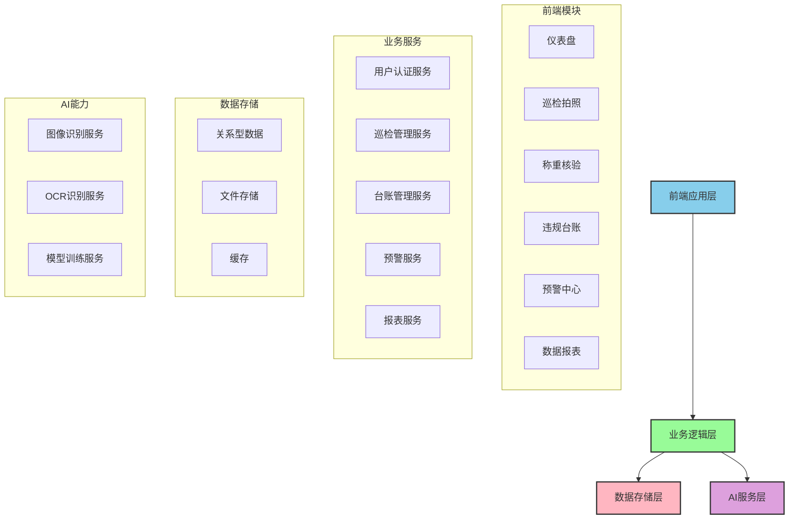
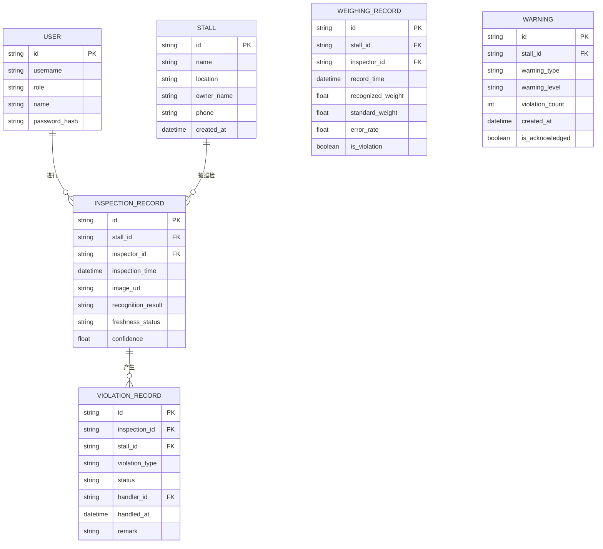

## 1. 架构设计



## 2. 技术选型

### 2.1 前端技术栈

| 技术 | 版本 | 用途 |
|------|------|------|
| React | ^18.2.0 | 前端框架 |
| TypeScript | ^5.0.0 | 类型系统 |
| Vite | ^5.0.0 | 构建工具 |
| Tailwind CSS | ^3.4.0 | CSS框架 |
| React Router | ^6.20.0 | 路由管理 |
| Recharts | ^2.10.0 | 数据可视化图表 |
| Lucide React | ^0.294.0 | 图标库 |
| Zustand | ^4.4.0 | 状态管理 |
| date-fns | ^3.0.0 | 日期处理 |

### 2.2 数据管理

| 技术 | 版本 | 用途 |
|------|------|------|
| Mock Service Worker | ^2.0.0 | API Mock |
| LocalStorage | - | 本地数据持久化 |

## 3. 路由定义

| 路由路径 | 页面名称 | 说明 |
|---------|---------|------|
| /login | 登录页 | 用户登录认证 |
| /dashboard | 仪表盘 | 数据概览、快捷入口 |
| /inspection | 巡检拍照 | 现场巡检、AI识别 |
| /weighing | 称重核验 | 称重图像采集、重量识别 |
| /violations | 违规台账 | 违规记录管理 |
| /warnings | 预警中心 | 预警查看、处理 |
| /reports | 数据报表 | 月度报表、分析 |
| /settings | 系统设置 | 摊位管理、用户管理 |

## 4. 数据模型

### 4.1 数据关系图



### 4.2 核心类型定义

```typescript
// 用户类型
interface User {
  id: string;
  username: string;
  name: string;
  role: 'inspector' | 'admin' | 'analyst';
  avatar?: string;
}

// 摊位类型
interface Stall {
  id: string;
  name: string;
  location: string;
  ownerName: string;
  phone: string;
  category: string;
  createdAt: string;
}

// 巡检记录类型
interface InspectionRecord {
  id: string;
  stallId: string;
  stallName: string;
  inspectorId: string;
  inspectionTime: string;
  imageUrl: string;
  recognitionResult: {
    category: string;
    categoryName: string;
    freshness: 'fresh' | 'normal' | 'rotten';
    confidence: number;
  };
}

// 违规记录类型
interface ViolationRecord {
  id: string;
  inspectionId: string;
  stallId: string;
  stallName: string;
  violationType: 'rotten' | 'underweight' | 'other';
  status: 'pending' | 'processing' | 'resolved';
  createdAt: string;
  handledAt?: string;
  remark?: string;
}

// 称重记录类型
interface WeighingRecord {
  id: string;
  stallId: string;
  recognizedWeight: number;
  standardWeight: number;
  errorRate: number;
  isViolation: boolean;
  recordTime: string;
}

// 预警类型
interface Warning {
  id: string;
  stallId: string;
  stallName: string;
  warningType: 'high_violation' | 'high_loss';
  warningLevel: 'low' | 'medium' | 'high';
  violationCount: number;
  createdAt: string;
  isAcknowledged: boolean;
}
```

## 5. 目录结构

```
src/
├── assets/              # 静态资源
├── components/          # 公共组件
│   ├── ui/            # 基础UI组件
│   ├── layout/        # 布局组件
│   └── charts/        # 图表组件
├── pages/              # 页面组件
│   ├── Login/
│   ├── Dashboard/
│   ├── Inspection/
│   ├── Weighing/
│   ├── Violations/
│   ├── Warnings/
│   └── Reports/
├── stores/             # 状态管理
├── services/         # API服务
├── types/          # 类型定义
├── utils/          # 工具函数
├── mock/           # Mock数据
├── hooks/          # 自定义Hooks
└── App.tsx         # 应用入口
```

## 6. 前端核心模块

### 6.1 状态管理 (Zustand)

- **useUserStore - 用户状态管理
- **useInspectionStore - 巡检数据管理
- **useViolationStore - 违规记录管理
- **useWarningStore - 预警管理

### 6.2 核心服务

- **apiService** - 通用API请求封装
- **imageService** - 图像处理服务
- **recognitionService** - 识别服务封装

### 6.3 工具函数

- **dateUtils** - 日期格式化工具
- **validator** - 表单验证工具
- **formatters** - 数据格式化工具
